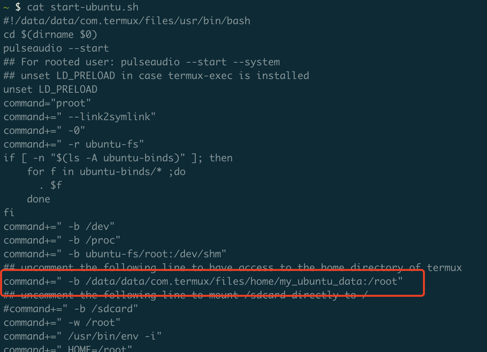
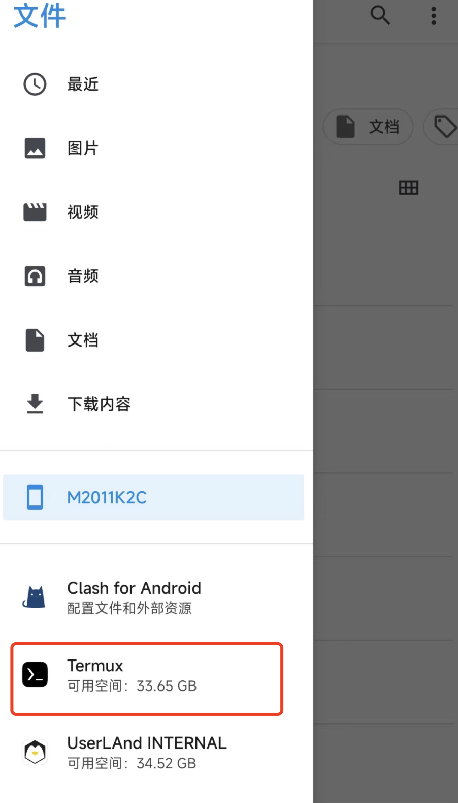
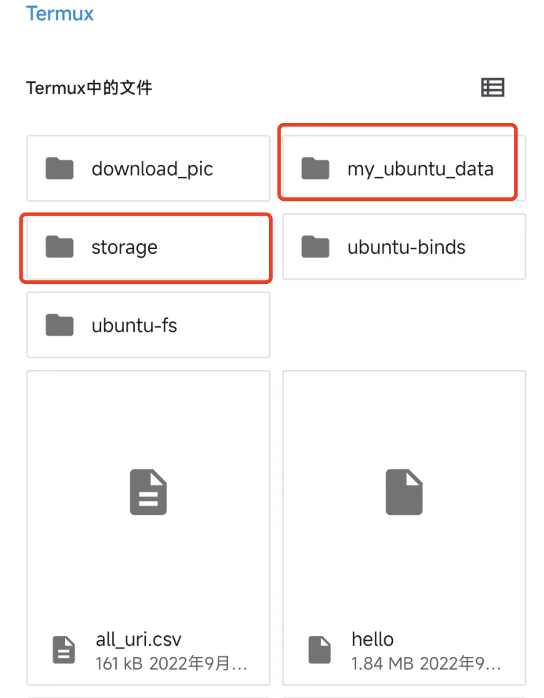

## 前言分析

主要目的：

把安卓手机变成随身服务器，变身为个人随时工作站，主要使用的相关功能

- 能够使用相关开发语言：python3，go
- 安装code-server，使用web版本随时在局域网内通过vscode进行编程工作

优势

- 取代云服务器，满足随时编码需求
- 使用vpn更方便，只要手机能使用vpn即可

劣势

稳定性可能较差，及数据存储可能不是很稳定，不建议做大量的数据存储使用。

数据及时做备份传输，备份方案后期可研究下。


## 方式1 ： userLAnd

相关命令

```sh
# ubuntu相关组件相关命令

# 登录
ssh username@host -p 2022 # userLAnd 默认的端口是2022

sudo apt update # 更新源
sudo apt install vim -y # 安装vim
sudo apt install net-tools -y # 安装网络工具，以使用ifconfig命令
sudo apt install inetutils-ping -y # 安装ping工具
sudo apt install git -y # 安装配置git
sudo apt install redis-server -y # 安装redis
sudo apt install python3 -y
sudo apt install pip -y
curl -fsSL https://code-server.dev/install.sh | sh # 安装vscode-server
```


## 方式2：termux + AnLinux

```sh
# termux centos 相关组件安装命令

ssh Linux@host -p 8022 # termux 默认的端口是8022,username 默认为Linux

# 在termux中执行的相关命令
pkg install x11-repo
pkg install root-repo

# 在linux中执行的相关命令（选用的是ubuntu）,相关安装命令可参考上面

# ------文件互通------
# 方式1：修改start-ununtu.sh，同时在该文件夹下创建一个映射文件夹，用来互传文件
# 方式2：可以访问/sdcard，用来直接访问系统相关文件夹
# 方式3：手机端在文件系统中访问Android>data,进入安卓存储框架，在右侧中通过此方式访问文档

```







## 方式3 ：AidLux

还没尝试过，后期有时间的话可以用下此方案，因为包比较大，所有之前的方案优先选的轻量级方案，且aidlux对旧手机可能不太友好

- https://aidlux.com/
- https://github.com/aidlearning/AidLearning-Framework


## 相关未解决问题

主要为使用userLAnd时出现的问题

###  1. 无法启用docker服务

```sh
# 问题复现
tao@localhost:~$ sudo service docker start
/etc/init.d/docker: 96: ulimit: error setting limit (Operation not permitted)
# 问题追踪
对于96行报错的是：ulimit -n 1048576，尝试直接执行相关命令进行验证
tao@localhost:~$ sudo ulimit -n 1048576
bash: line 0: ulimit: open files: cannot modify limit: Operation not permitted
# 问题修复（TODO）
目前该问题暂时先不想修复，因为暂时用不到docker，后期尝试【直接使用root账号创建资源】将账号统一化，看下该问题能否修复
```


## 参考资料

- [Ubuntu安装docker](https://yeasy.gitbook.io/docker_practice/install/ubuntu)

- [极致安卓之—Termux安装完整版Linux](https://zhuanlan.zhihu.com/p/95865982)

